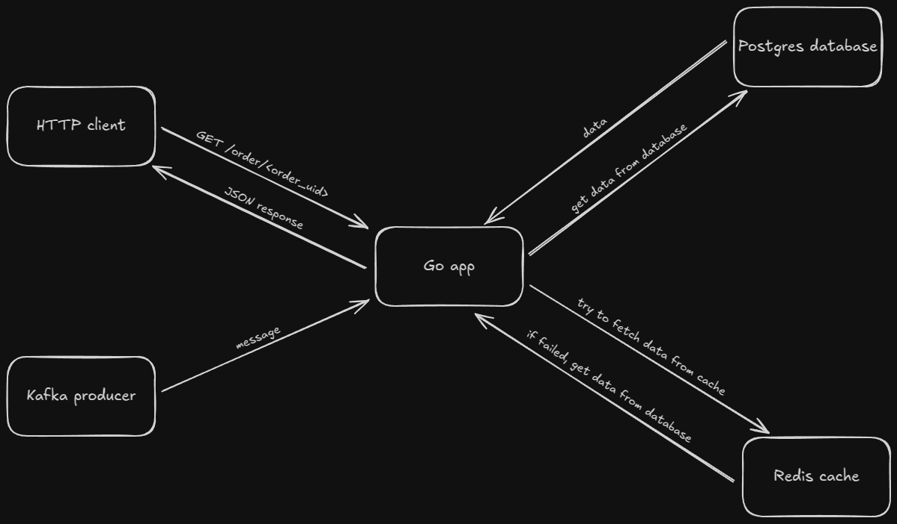

# order-service

Demonstrational service built with Go, Kafka, PostgreSQL, and Redis. The service listens to Kafka for incoming order data, stores it in PostgreSQL, and caches recent orders for faster retrieval. It provides an HTTP API to fetch order details by ID, serving data from the cache or database as needed, and includes a simple web interface for viewing orders. On startup, the service preloads the cache from the database to ensure quick responses immediately after launch.

## Example Video

You can check out example video at https://disk.yandex.ru/d/bAvi5Uj-LnZDCQ.

## Architecture



## Getting Started

Follow these steps to run the application:

1. **Clone the Repository**:
    ```bash
    git clone https://github.com/realdanielursul/order-service
    ```

2. **Enter Directory**
    ```bash
    cd order-service
    ```

3. **Install Required Go Packages:**
    ```bash
    go mod tidy
    ```

4. **Run the Application:**
    ```bash
    docker-compose up -d
    ```

5. **Connect to Kafka Producer:**
    ```bash
    docker exec -it <container_id> bash

    kafka-console-producer --broker-list kafka:9092 --topic order
    ```

6. **Access the API:**
The API will be available at http://localhost:8080.

## Technologies Used:
- **Go**: Core backend logic and API.

- **Kafka**: Message broker for streaming incoming data.

- **Redis**: In-memory cache for quick data retrieval.

- **PostgreSQL**: Relational database for data storage.

- **Docker**: For app containerization.
